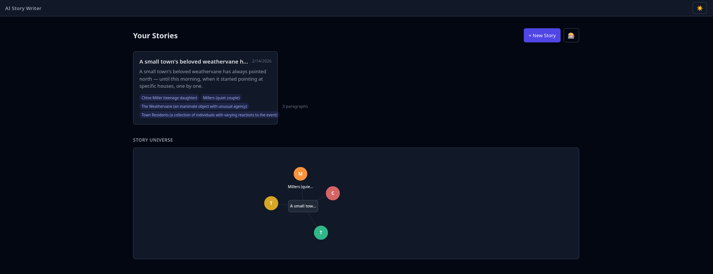

## Screenshot

See: `2026-04-09-dashboard-ui-bugs-screenshot.png` (copied from user clipboard)

## Root Cause

Three separate issues:

1. **Character hover name clipped**: The SVG `viewBox="0 0 600 300"` clips content at the boundary. Character nodes near edges/bottom have their hover labels (`y + 30`) cut off by the SVG rectangle. The hover label was rendered inside the raw SVG without any transform group.

2. **"3 paragraphs" escapes card**: `.card-footer` used `justify-content: space-between` but `.card-characters` could grow unbounded with multiple badges, pushing `.card-nodes` outside the card. Neither the footer nor the characters container had `overflow: hidden` or `min-width: 0` to constrain flex children.

3. **Can't pan/zoom Story Universe graph**: `DashboardGraph.svelte` had no zoom/pan implementation at all — just a static SVG. Unlike `NodeGraph.svelte` which has full wheel zoom + pointer drag panning + zoom controls, the dashboard graph was completely non-interactive beyond hover highlighting.

## Fix

**Files modified:**
- `02-worktrees/webapp-ui/frontend/src/lib/components/DashboardGraph.svelte`
- `02-worktrees/webapp-ui/frontend/src/lib/components/StoryCard.svelte`

**DashboardGraph changes:**
- Added zoom/pan state (`scale`, `panX`, `panY`, `isPanning`)
- Added `handleWheel`, `handlePointerDown/Move/Up` event handlers (same pattern as NodeGraph)
- Wrapped SVG in a `.graph-viewport` div with `overflow: hidden`, `position: relative`, `cursor: grab`
- Added `<g transform="translate({panX}, {panY}) scale({scale})">` wrapper inside SVG
- Added zoom control buttons (+, -, 1:1) with percentage display
- Moved border/border-radius from SVG to viewport div
- Hover labels now render inside the transform group, so they pan/zoom with the graph

**StoryCard changes:**
- Added `overflow: hidden` to `.card-footer`
- Added `min-width: 0` and `flex: 1` and `overflow: hidden` to `.card-characters`

## Verification

1. Open dashboard → StoryCard shows "3 paragraphs" inside card boundary
2. Hover character nodes in Story Universe → name appears, not clipped
3. Scroll wheel on graph → zooms in/out
4. Click+drag on graph → pans around
5. Zoom controls (+/-/1:1) work at bottom-right of graph
