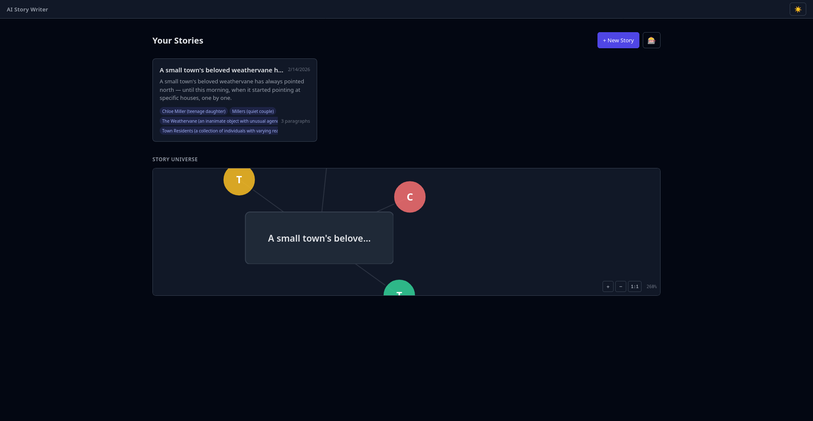

## Screenshot

See: `2026-04-09-story-node-text-wrap/20260409174907.png` (copied from user clipboard)

## Root Cause

The foreignObject fix from the previous debug session replaced the SVG rect with an HTML div, but two issues remained:
1. JavaScript still truncated the title at 22 chars with `…` — the full text was never rendered
2. `.story-node-card` had `overflow: hidden` which clipped any text that tried to wrap
3. The foreignObject was only 64px tall — insufficient for wrapped text

## Fix

- Removed JS truncation entirely — `{n.label}` now renders the full title
- Removed `overflow: hidden` from `.story-node-card`
- Added `word-wrap: break-word` and `overflow-wrap: break-word` for natural text wrapping
- Increased foreignObject height from 64px to 80px, adjusted y offset from -32 to -40

**File modified:** `02-worktrees/webapp-ui/frontend/src/lib/components/DashboardGraph.svelte`

## Verification

1. Story nodes show full titles — no `…` truncation
2. Long titles wrap to multiple lines inside the node box
3. Text stays within the card boundaries
4. Click, pan, zoom still work
