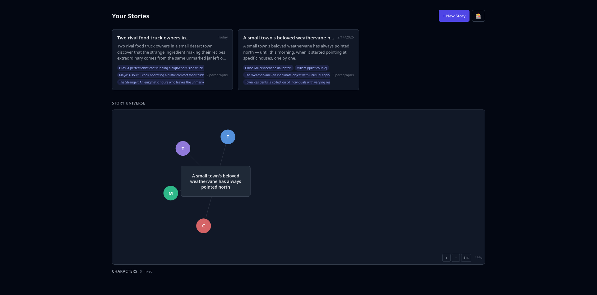
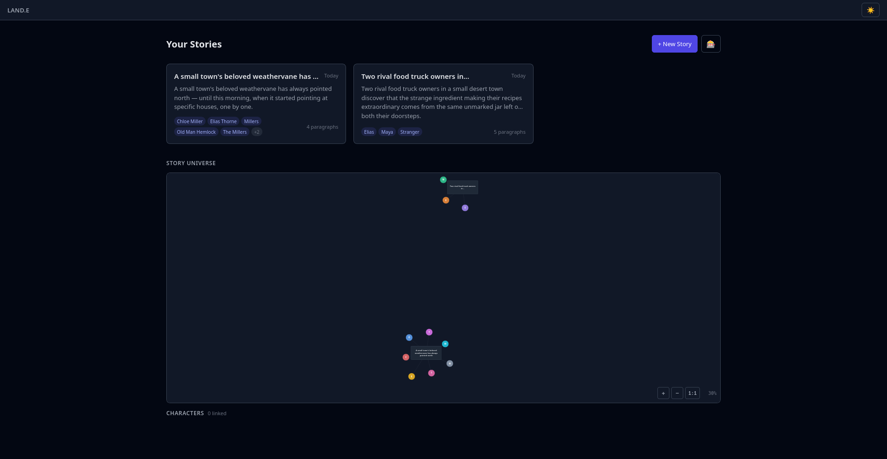
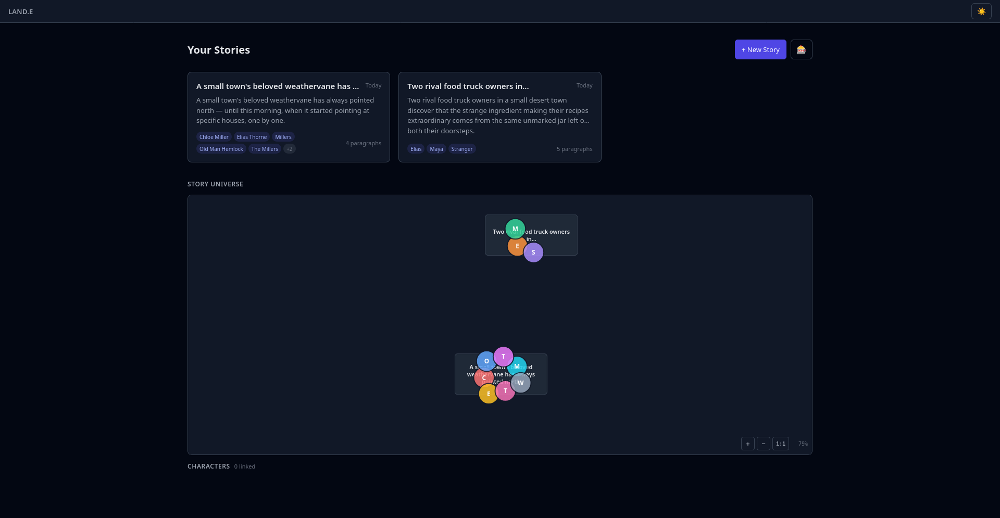
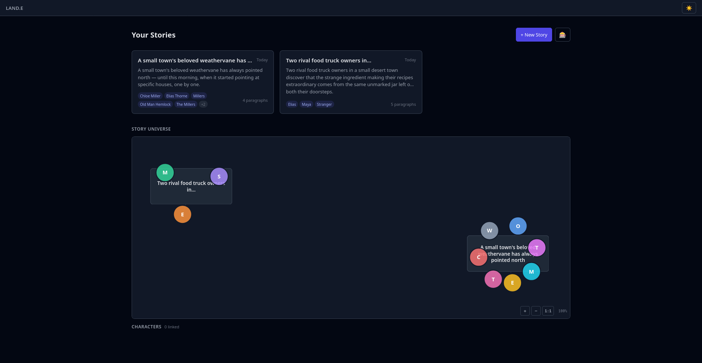
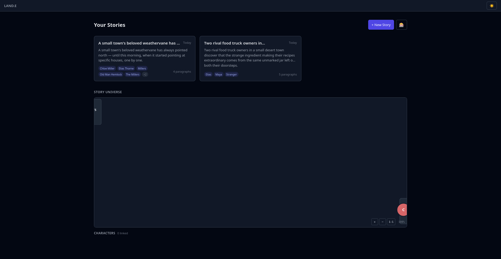
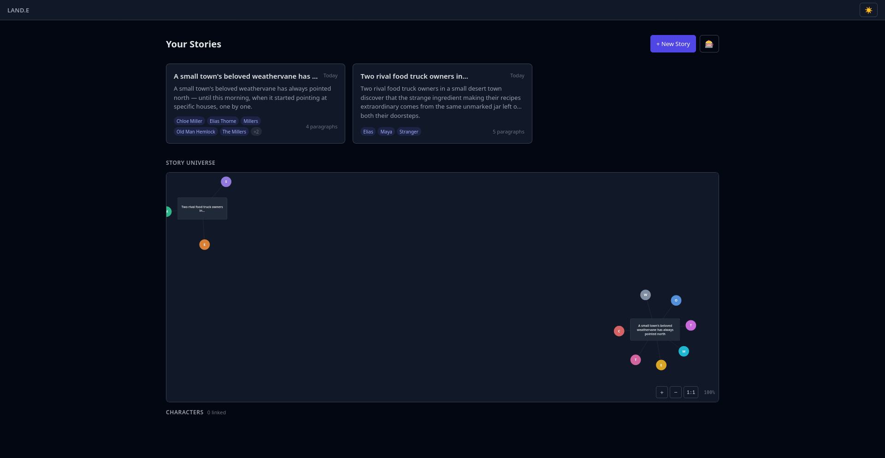
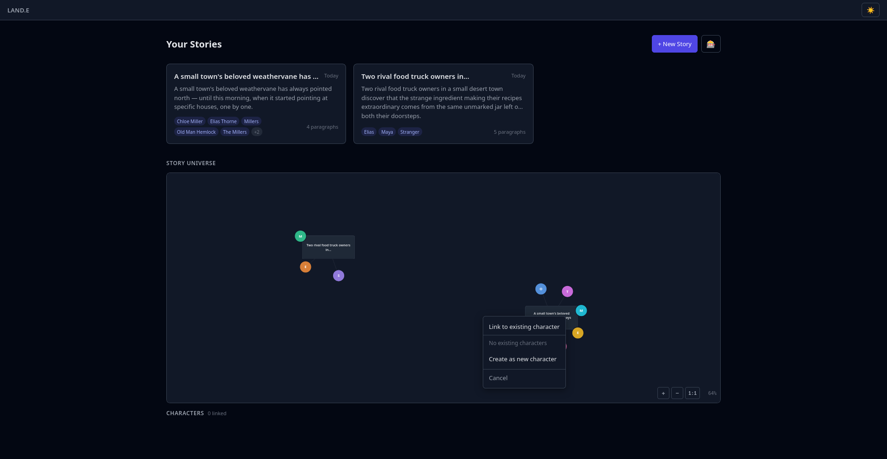

## Screenshot

See: `2026-04-11-story-universe-missing/20260411021506.png` (copied from user clipboard)

### Graph still too spread out after first fix

See: `2026-04-11-story-universe-missing/20260411024200.png` — had to zoom way out to see nodes

### After fit scaling — nodes overlapping

See: `2026-04-11-story-universe-missing/20260411024400.png` — auto-fit compressed nodes too close, causing overlaps

### After collision fix — chars still too close to story cards

See: `2026-04-11-story-universe-missing/20260411024700.png`

### After link distance bump — still cramped, forced into fixed 800x400

See: `2026-04-11-story-universe-missing/20260411024900.png` — fundamental problem: hardcoded viewBox squash

### After dynamic viewBox — still too large, needs zoom out

See: `2026-04-11-story-universe-missing/20260411025200.png`

### Final fix: auto-fit via zoom/pan transform

Instead of trying to squeeze the graph into a fixed viewBox, the simulation runs freely with good collision detection. Then the initial zoom `scale` and `panX`/`panY` are computed to auto-fit the graph in the 800×500 viewport. The existing zoom/pan controls let users explore. `resetView()` returns to the auto-fit state.

### "Link to existing character" context menu not working

See: `2026-04-11-story-universe-missing/20260411030200.png` — context menu for unlinked character node, "Link to existing character" dropdown

## Root Cause

The `StoryAnalysis.cast` Pydantic field was `list[str]` with the prompt "Bullets: Name — role/goal/conflict; ties." The LLM consistently ignored the em-dash format and output verbose strings like `"Elias: A perfectionist chef running a high-end fusion truck, struggling to stay afloat."` and `"Chloe Miller (teenage daughter)"`.

This caused two downstream problems:

1. **Verbose character names in `character_mentions`**: The `extract_characters()` parser didn't handle `: ` as a delimiter, so entire verbose descriptions were stored as character names.
2. **No cross-story matching**: The `stories_overview()` endpoint groups by exact `character_name`, so "Elias: A perfectionist chef..." in one story would never match "Elias Thorne" in another.

## Fix

**Root fix — structured `CastMember` Pydantic model:**

Added `CastMember(name, role)` sub-model to `schemas.py` and changed `StoryAnalysis.cast` from `list[str]` to `list[CastMember]`. This forces the LLM to output clean, machine-readable (name, role) pairs from the start.

**Supporting changes:**

1. **`schemas.py`** — New `CastMember` class with explicit field descriptions ("Character name only. Just the name")
2. **`story.py`** — Simplified `extract_characters()` to iterate `CastMember` objects instead of parsing strings
3. **`types/index.ts`** — New `CastMember` interface, updated `StoryAnalysis.cast` type
4. **`AnalysisPanel.svelte`** — Renders `<strong>{member.name}</strong> — {member.role}` instead of regex-based HTML injection
5. **`database.py`** — Added `: ` strip to `normalize_character_name()` as safety net for any legacy edge cases
6. **Data migration** — Cleaned 7 `character_mentions` records and migrated 3 `node_analyses` JSON blobs from `list[str]` to `list[{name, role}]`

## Files Modified

- `backend/app/models/schemas.py` — Added `CastMember`, changed `StoryAnalysis.cast`
- `backend/app/services/story.py` — Simplified `extract_characters()`
- `backend/app/models/database.py` — Added colon-strip to `normalize_character_name()`
- `frontend/src/lib/types/index.ts` — Added `CastMember` interface
- `frontend/src/lib/components/AnalysisPanel.svelte` — Structured cast rendering
- `backend/data/stories.db` — Migrated existing data

## Verification

1. Start the app (`cd 02-worktrees/webapp-ui && make dev`)
2. Dashboard graph shows both stories with clean character nodes ("Elias", "Maya", "Chloe Miller", "Weathervane")
3. Generate new content in either story → `character_mentions` stores clean names like "Elias Thorne" (not verbose descriptions)
4. Analysis panel renders cast with bold names and em-dash separated roles
5. When same character name appears in 2+ stories, the candidates endpoint surfaces the match for linking

---

## Session 2: "Link to existing character" doesn't work (2026-04-11)

### Root Cause

Three issues in `DashboardGraph.svelte`:

1. **Menu positioning formula was wrong**: Used `(x + panX) * scale` instead of `x * scale + panX`, causing the context menu to drift from the character node when zoomed/panned (could push menu partially off-screen due to `overflow: hidden` on viewport)
2. **Missing `loadCharacters()` after linking**: `linkToExisting()` called `loadCandidates()` and `loadGraph()` but not `characterState.loadCharacters()`, so the canonical characters dropdown went stale after first link
3. **No error feedback in context menu**: API errors were set on `characterState.error` but the context menu template didn't render them

### Fix

1. Fixed positioning: `{activeMenuPos.x * scale + panX}px` (matches SVG `translate(panX, panY) scale(scale)` transform)
2. Added `characterState.loadCharacters()` to post-link refresh via `Promise.all([loadCandidates(), loadCharacters()])`
3. Added `{#if characterState.error}` block inside the context menu with red error styling
4. Improved empty dropdown text: "No existing characters — use \"Create as new\" first"

### Files Modified

- `frontend/src/lib/components/DashboardGraph.svelte` — Positioning fix, loadCharacters call, error display

### Verification

1. Start the app (`cd 02-worktrees/webapp-ui && make dev`)
2. Create a canonical character by clicking a character node → "Create as new character"
3. Click another character node → "Link to existing character" → dropdown shows the created character
4. Click the character in the dropdown → graph refreshes, both characters now linked
5. If API error occurs, red error message appears inside the context menu
