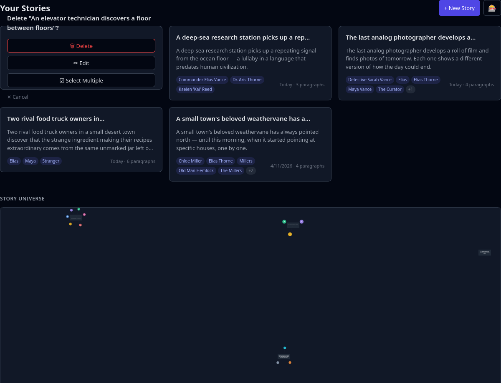
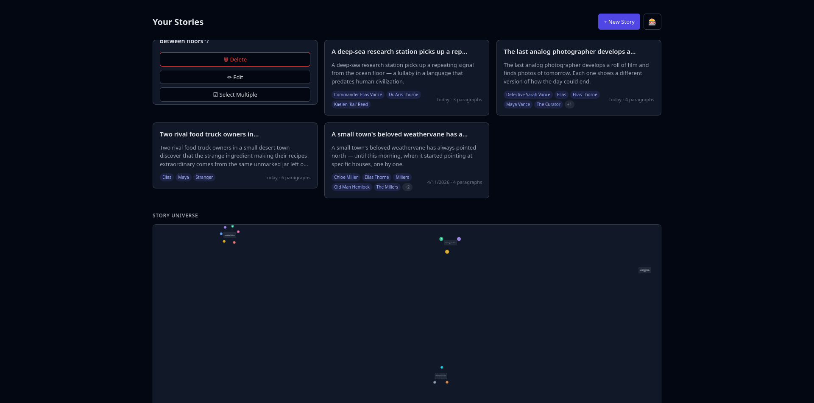
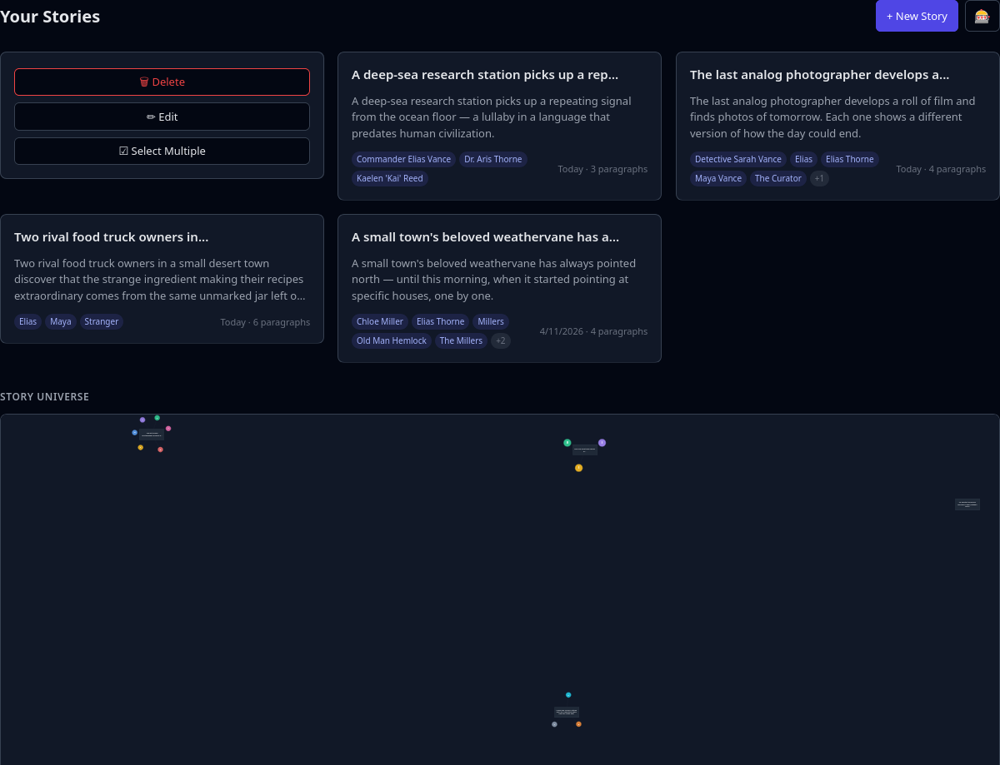

## Issue

When clicking the trash icon on a story card, the back face (delete confirmation) displays:

> Delete "An elevator technician discovers a floor between floors"?

This long title text overflows the card boundaries, pushing buttons and cancel link outside the visible area.

### Screenshots (before fix)

See: `00-supporting-files/images/2026-04-29-delete-overflow/`

### Secondary issue: tooltip on heading leaked to button hover

First attempt moved the full delete text to a `title` tooltip on the `<h3>` heading, but hovering over the 🗑 Delete button triggered the tooltip from the heading above it.

## Root Cause

The back face `.card-back` used `position: absolute; inset: 0` with no `overflow: hidden` or `min-height`, so the full title text in `Delete "{story.title}"?` rendered beyond the card boundaries.

## Fix

Replaced the verbose `Delete "{story.title}"?` heading with a short `Delete this story?`. The `title` tooltip with the full delete message (`Delete "story_title"?`) is on the **🗑 Delete button** only — so it only appears when hovering the button, not the heading. Added `overflow: hidden` and `min-height: 140px` to `.card-back` as a safety constraint.

### Changes

**File:** `02-worktrees/webapp-ui/frontend/src/lib/components/StoryCard.svelte`

1. Changed back-title from `Delete "{story.title}"?` → `Delete this story?` (no tooltip on heading)
2. Added `title={"Delete \"" + story.title + "\"?"}` to the 🗑 Delete button only
3. Added `overflow: hidden` + `min-height: 140px` to `.card-back`

## Verification

- Click trash icon → back face shows compact "Delete this story?" with all buttons visible
- Hover over 🗑 Delete button → tooltip shows `Delete "An elevator technician discovers a floor between floors"?`
- No tooltip when hovering the heading or other buttons
- All buttons (Delete, Edit, Select Multiple, Cancel) fit within the card
- `svelte-check` passes with 0 errors
