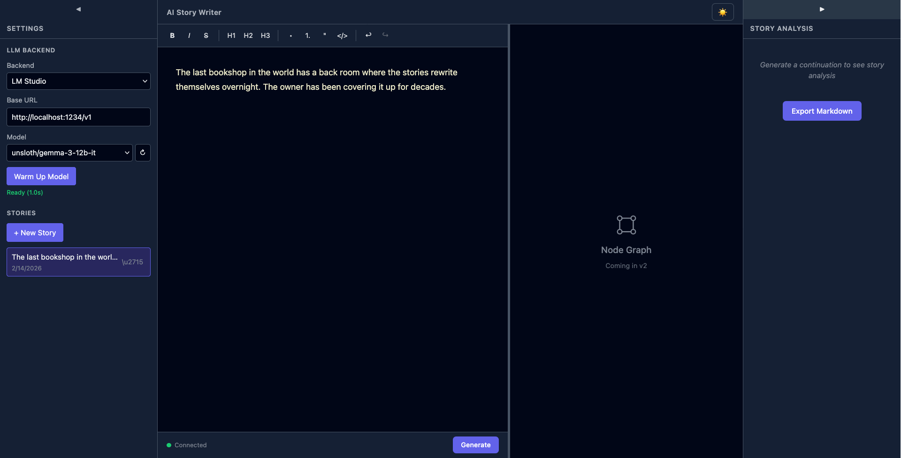

# Phase 02 Plan 08: Bug Fixes Summary

**Fix 5 user-reported bugs: accept truncation, missing space, no generating animation, empty title on random premise, broken delete button**

## Performance

- **Duration:** 5 min
- **Started:** 2026-02-14
- **Completed:** 2026-02-14
- **Tasks:** 5
- **Files modified:** 4

## Accomplishments
- **CRITICAL FIX:** Accept button now keeps AI-generated text in the editor. Added `lastAction` field (`'accepted' | 'rejected' | null`) to `GenerationState` so the editor's `$effect` can distinguish accept from reject without relying on `draftContent` state (which was already cleared by the time the effect ran)
- Space is automatically prepended before the first AI token when the editor's last character is not whitespace, preventing concatenated text like "gone.The"
- "Generating..." status now shows a pulsing indigo dot animation (reuses existing `@keyframes pulse`) with highlighted text color
- "I'm Feeling Lucky" now auto-generates a story title by extracting text before the em dash in the premise (or first 6 words as fallback)
- Delete button on story items now renders the cross icon correctly instead of literal `\u2715` text, and no longer overlaps the truncated story title

### Delete button bug

## Task Commits

1. **Task 1-4: All bug fixes** — (fix) `1e74c1b`
2. **Task 5: Delete button fix** — (fix) `5e2316d`

## Files Modified
- `frontend/src/lib/stores/generation.svelte.ts` — Added `DraftAction` type and `lastAction` field; set in accepted/rejected handlers, reset in startGeneration
- `frontend/src/lib/components/Editor.svelte` — Check `lastAction === 'rejected'` instead of `draftContent === ''`; prepend space on first token when last editor char is non-whitespace
- `frontend/src/lib/components/GenerationControls.svelte` — Added pulsing dot span and `.generating` / `.generating-dot` CSS for animated generation status
- `frontend/src/lib/components/SettingsPanel.svelte` — `feelingLucky()` now sets `newStoryTitle` from premise text before em dash (or first 6 words); delete button uses `{'\u2715'}` JS expression instead of bare markup; added `gap` to `.story-item` and `overflow: hidden` to `.story-info`

## Decisions Made
- **Explicit action tracking over inference:** The root cause of bug 4 was the editor inferring accept/reject from `draftContent === ''`, but both handlers cleared it. Adding `lastAction` is a 4-line change that eliminates the entire class of race conditions.
- **Client-side title extraction:** Rather than adding titles to the backend premise pool (which would require restructuring the data), extracting from the em dash delimiter works perfectly since all 25 premises use this format.

## Deviations from Plan

None — all 5 bugs fixed as diagnosed.

## Issues Encountered
None

## Self-Check: PASSED

- Accept keeps text, reject removes text — race condition eliminated
- Space insertion guards against double-space (checks for existing whitespace)
- Animation reuses existing keyframes, no new CSS dependencies
- Title extraction handles edge cases with fallback to first 6 words
- Delete button renders cross icon and stays in its own column

---
*Phase: 02-webapp-ui*
*Completed: 2026-02-14*
