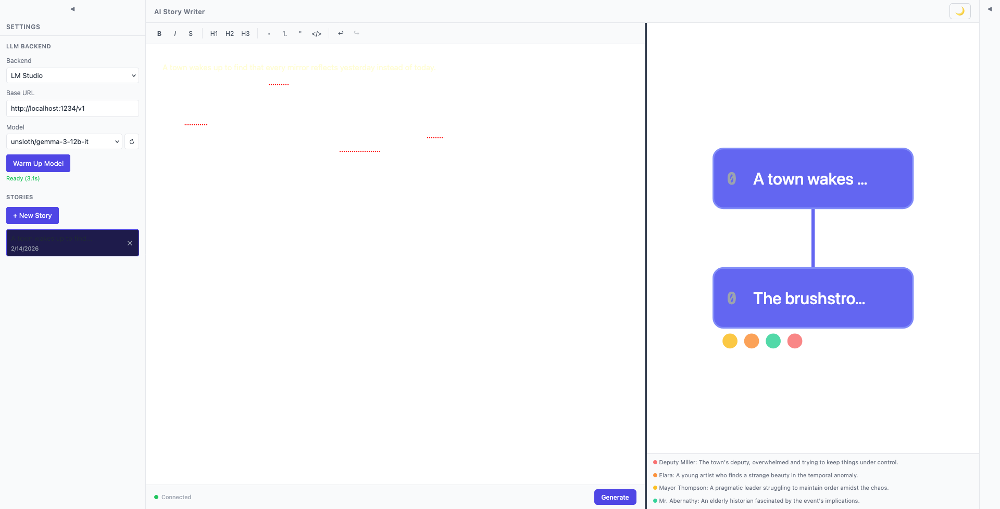

# Plan 02-11 Summary: Bug Fixes — Provenance Visibility, Graph Rework, Node Labels

## What Was Done

Fixed three bugs identified during user testing: invisible provenance marks in light mode, rectangular graph nodes replaced with bipartite circle design, and node labels all showing "0".

### Changes

**Provenance Marks — `frontend/src/lib/extensions/provenance.ts`:**
- Renamed `PROVENANCE_COLORS` → `PROVENANCE_STYLES` to reflect the new approach
- Changed from text `color` to `background-color` tints that work in both dark and light themes:
  - ai_generated: violet tint (rgba(139, 92, 246, 0.12))
  - user_written: blue tint (rgba(59, 130, 246, 0.12))
  - user_edited: pink tint (rgba(244, 114, 182, 0.15))
  - initial_prompt: amber tint (rgba(251, 191, 36, 0.12))
- Updated `renderHTML` to apply background tint with `border-radius: 2px; padding: 0 1px`
- Text color now inherits from the editor's theme — provenance is indicated by background only

**Node Graph Rework — `frontend/src/lib/components/NodeGraph.svelte`:**
- Complete rewrite from rectangle-based layout to bipartite circle graph:
  - Paragraph nodes: compact circles (radius 14) with depth number labels inside
  - Character supernodes: colored circles (radius 18) in a column to the right, with 3-char abbreviation inside and full name label beside
  - Tree edges: straight lines between parent→child paragraphs, active path highlighted in indigo
  - Character cross-edges: thin colored lines (opacity 0.18) connecting paragraph centers to character supernode centers
- Removed character badges from paragraph nodes (replaced by cross-edges)
- Removed character legend bar (characters are now directly visible as supernodes)
- Switched from SVG viewBox scaling to scrollable container (`overflow: auto`)
- Fixed node position labels: changed `position: n.data.position` (sibling order, always 0 for linear stories) to `position: n.depth` (d3 hierarchy depth, giving sequential 1, 2, 3... labels)

### Commits

- **webapp-ui branch:** `2ea7f3e` — fix(02-11): light mode provenance visibility, graph visualization rework, node position labels

### Decisions

- Background-color tints instead of text color for provenance — works in both themes without any theme-aware CSS, inspired by NovelAI's approach
- Bipartite graph design (paragraphs + character supernodes) instead of badges — scales better with many characters and shows relationships more clearly
- Scrollable container instead of viewBox scaling — prevents tiny nodes in large trees, gives consistent node sizes
- Used d3 hierarchy `.depth` property for node labels instead of the DB `position` field — depth represents actual tree level, position represents sibling order

### Next Steps

- Pan/zoom for large trees (mouse wheel zoom, drag to pan)
- Click a paragraph node to highlight its content in the editor
- Hover a character supernode to highlight all connected paragraph nodes
