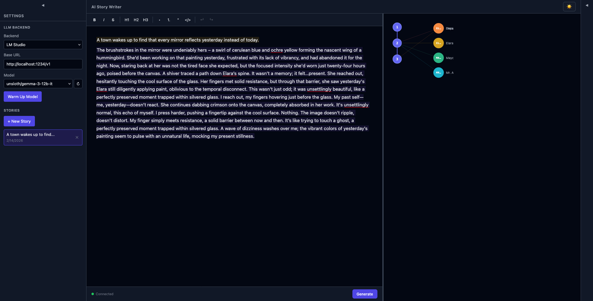

<objective>
Add hover interactions and zoom/pan navigation to the node graph visualizer. Users need to see paragraph content and character details without leaving the graph, and navigate large trees by zooming and panning.

**Hover tooltips:** Replace native SVG `<title>` elements (small, delayed, ugly) with styled floating HTML divs that appear instantly on mouseenter. Paragraph tooltips show a content preview (up to 200 chars) and the list of characters mentioned. Character tooltips show the full name and how many paragraphs they appear in.

**Zoom/pan:** Replace the scroll-based overflow container with an SVG transform group (`translate + scale`). Mouse wheel zooms anchored to cursor position. Left-click drag on empty viewport area pans. Zoom controls in the bottom-right provide +/- buttons, 1:1 reset, and a percentage readout.
</objective>

<worktree>
branch: webapp-ui
path: 02-worktrees/webapp-ui/
All code changes target files within this worktree. Frontend at frontend/.
</worktree>

<tasks>

<task id="1" title="Add custom hover tooltips for paragraph and character nodes">
<action>
1. Add TooltipData interface and tooltip state ($state)
2. Add showParaTooltip/showCharTooltip/hideTooltip functions that position a floating div at the mouse cursor
3. Paragraph tooltip: title "Paragraph N", body with truncated content (200 chars) + character names
4. Character tooltip: title with colored dot + character name, body with paragraph count
5. Replace native `<title>` elements with onmouseenter/onmouseleave handlers on `<g>` groups
6. Style tooltip with dark background, border, shadow, proper z-index
</action>
<files>
- 02-worktrees/webapp-ui/frontend/src/lib/components/NodeGraph.svelte
</files>
<verify>
- Hovering a paragraph node shows styled tooltip with content and characters
- Hovering a character supernode shows styled tooltip with name and count
- Tooltip disappears on mouse leave
</verify>
</task>

<task id="2" title="Add zoom and pan navigation">
<action>
1. Replace scroll container with a viewport div that captures pointer/wheel events
2. Add zoom state (scale, panX, panY) with min 0.3x / max 3x range
3. Wrap all SVG content in a `<g transform="translate(...) scale(...)">` group
4. Mouse wheel handler: zoom anchored to cursor position (keep point under cursor fixed)
5. Pointer down/move/up handlers: drag-to-pan on left click (empty area) or middle mouse
6. Add zoom control buttons (+ / - / 1:1 reset) and percentage readout in bottom-right corner
7. Reset zoom/pan when tree data changes (new story loaded)
</action>
<files>
- 02-worktrees/webapp-ui/frontend/src/lib/components/NodeGraph.svelte
</files>
<verify>
- Mouse wheel zooms in/out centered on cursor
- Dragging on empty area pans the graph
- Zoom controls work and show current percentage
- 1:1 reset returns to default view
</verify>
</task>

</tasks>
