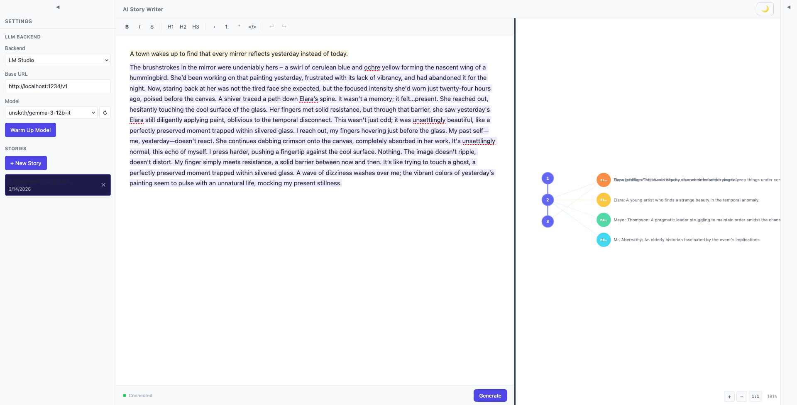

# Plan 02-13 Summary: Visual Bug Fixes — Theme Awareness, Provenance Visibility, Graph Cleanup

## What Was Done

Fixed four visual bugs identified during light/dark mode testing.

### Changes

**SettingsPanel.svelte — Active story highlight:**
- Replaced hardcoded `background-color: #1e1b4b` with `var(--active-story-bg, rgba(79, 70, 229, 0.15))` — semi-transparent indigo tint that works in both themes
- Replaced hardcoded `border-color: #4f46e5` with `var(--active-story-border, #6366f1)`

**provenance.ts — Background tint opacity:**
- Increased all PROVENANCE_STYLES opacity values from 0.12 to 0.22 (violet, blue, amber) and from 0.15 to 0.25 (pink)
- Tints are now visible on dark editor backgrounds without being too harsh on light backgrounds

**NodeGraph.svelte — Graph label cleanup:**
- Removed the `<text>` element that displayed full character names next to supernodes — tooltips (added in 02-12) provide this info on hover
- Removed the `.char-name` CSS class definition
- Reduced `CHAR_COLUMN_X_OFFSET` from 120 to 60 — graph is more compact since no text labels to accommodate

**NodeGraph.svelte — Cross-edge visibility:**
- Increased `.char-edge` opacity from 0.18 to 0.38 — connections between paragraphs and characters are now clearly visible

### Commits

- **webapp-ui branch:** `f217867` — fix(02-13): light-mode story highlight, dark-mode provenance visibility, graph label cleanup, edge opacity

### Decisions

- Used CSS custom properties with rgba fallbacks for active story styling — the fallback values work well in both themes without needing separate dark/light mode overrides
- Chose 0.22 opacity for provenance tints as a compromise — visible enough on dark backgrounds (#1a1a2e range) while still subtle on white backgrounds
- Removed character name labels entirely rather than shortening them — tooltips from 02-12 already provide full character details on hover, and the labels cluttered the compact bipartite layout
