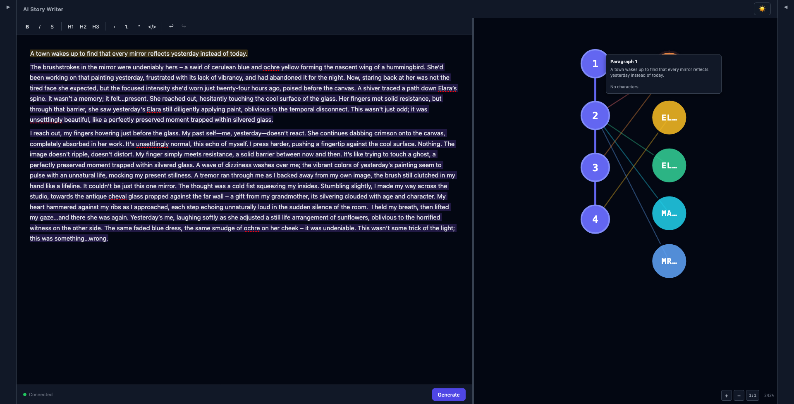
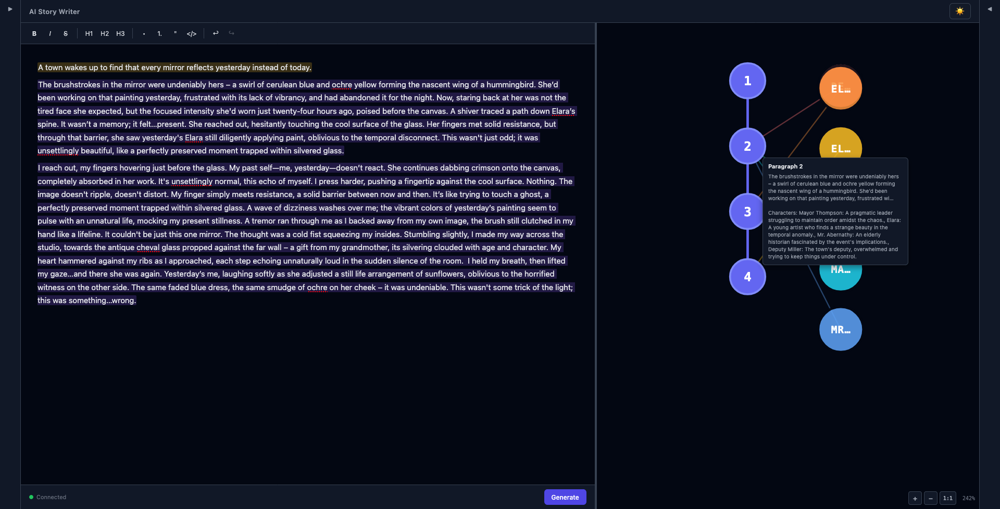
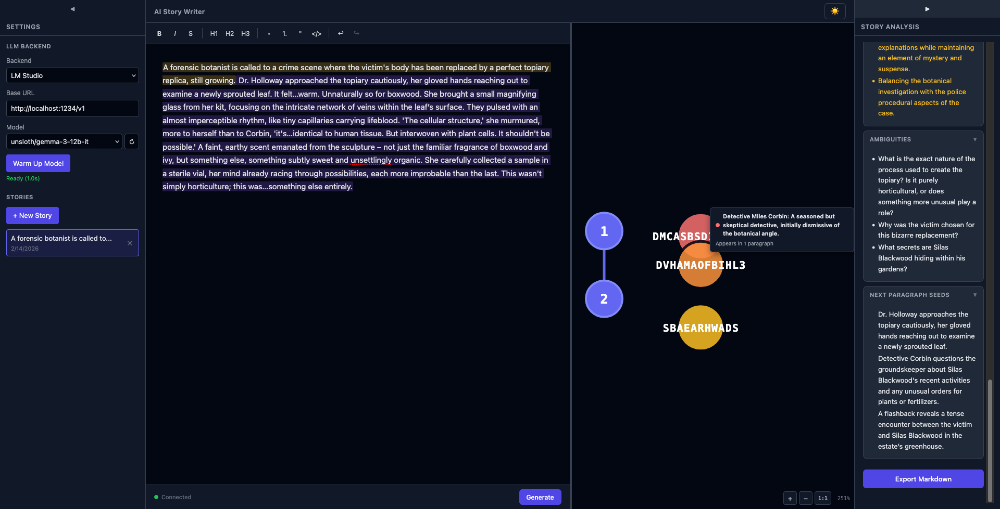

# Plan 02-14 Summary: Character Initials Labels, Remove Cross-Edges from Graph

## What Was Done

Simplified the node graph by using proper initials for character labels and removing the paragraph-to-character cross-edges that cluttered the visualization.

### Before (issues addressed)

### Changes

**NodeGraph.svelte — Character initials:**
- Added `initials(name: string)` helper function that splits on whitespace and takes the first character of each word: "John Doe" → "JD", "Gandalf" → "G"
- Replaced `truncate(c.name, 3).toUpperCase()` with `initials(c.name)` in the character supernode `<text>` element

**NodeGraph.svelte — Remove cross-edges:**
- Removed `characterNames` field from `PositionedParagraph` interface and its population from the paragraph builder
- Removed `CharEdge` interface entirely
- Removed `charEdges` from `GraphLayout` interface and the return object
- Removed the cross-edge building loop (previously step 5 in layout computation)
- Removed the cross-edge SVG rendering (`{#each layout.charEdges ...}`)
- Removed `.char-edge` CSS class
- Simplified `showParaTooltip` — body now shows only the content preview, no character names

### Commits

- **webapp-ui branch:** `c842bc2` — refactor(02-14): character initials labels, remove cross-edges and character info from paragraph nodes

### Decisions

- Used proper initials extraction instead of substring truncation — "John Doe" → "JD" is more recognizable than "JOH"
- Removed cross-edges entirely rather than making them optional — tooltips on character supernodes already show paragraph count, and the lines added visual noise in the compact bipartite layout
- Kept the character column as a standalone reference — hover tooltips still show full name and appearance count
