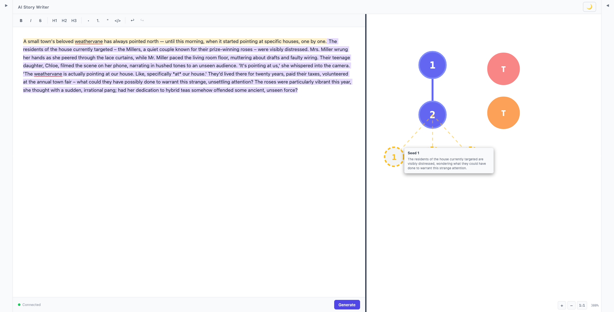
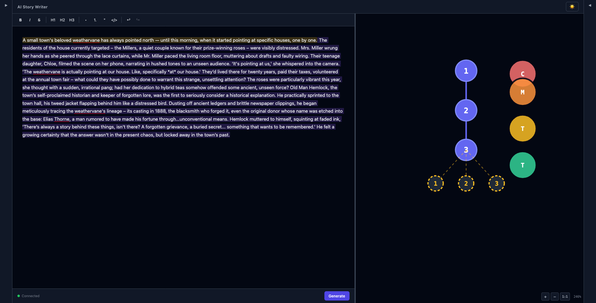
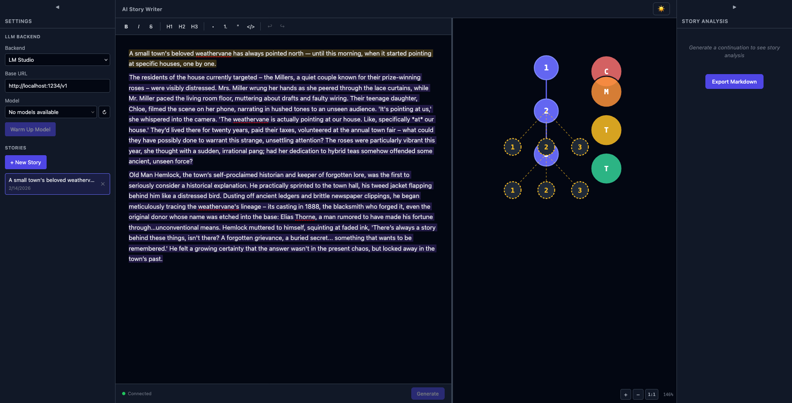
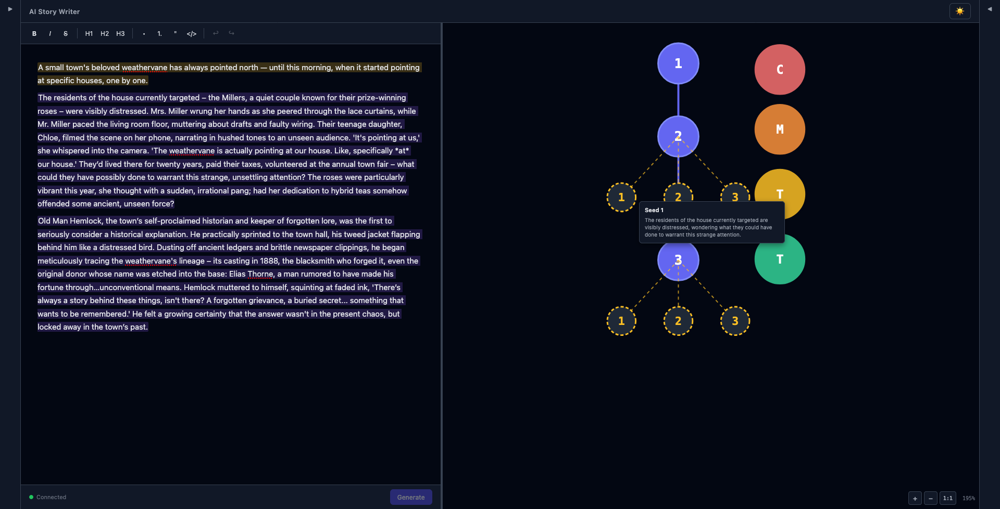

# Plan 02-16 Summary: Graph Polish & Seed Persistence

## What Was Done

Enlarged all graph nodes for readability, made seed colors theme-aware, persisted seeds per-node from tree data, fixed SVG layering so seed edges render behind paragraph nodes, improved splitter visibility, fixed seed-paragraph overlap with a post-layout spacing pass, and enlarged tooltip text/box to match editor font size.

### Before (issues addressed)

### Changes

**NodeGraph.svelte — Increased sizes:**
- Layout constants enlarged ~1.5x: P_RADIUS 14→20, CHAR_RADIUS 18→26, SEED_RADIUS 10→14
- Spacing proportionally increased: TREE_SPACING_X 50→72, TREE_SPACING_Y 52→72, SEED_SPACING_X 40→56, SEED_OFFSET_Y 44→60, CHAR_COLUMN_X_OFFSET 60→80, CHAR_SPACING_Y 48→64, PADDING 30→40
- Font sizes increased: para-label 10px→13px, char-label 8px→12px, seed-label 8px→11px

**NodeGraph.svelte — Per-node seed persistence:**
- Added `parentId: string` to `PositionedSeed` interface
- Replaced seed layout computation — iterates all descendants and reads `n.data.analysis?.next_paragraph_seeds` from each tree node's persisted analysis (previously only read from `generationState.lastAnalysis`)
- Seeds now appear below every paragraph node that has analysis data, not just the last active node
- `handleSeedClick` uses `seed.parentId` to generate from the correct parent node

**NodeGraph.svelte — SVG layering fix:**
- Reordered SVG render layers: (1) tree edges, (2) seed edges, (3) paragraph nodes, (4) character supernodes, (5) seed node circles — seed dashed lines now render behind paragraph nodes
- Uses composite keys `${s.parentId}-edge-${s.index}` / `${s.parentId}-node-${s.index}` for uniqueness

**NodeGraph.svelte — Theme-aware seed colors:**
- Replaced hardcoded amber (#fbbf24) with `var(--seed-stroke, #fbbf24)` in `.seed-edge`, `.seed-circle`, `.seed-label`
- Hover state uses `var(--seed-hover-bg)` and `var(--seed-stroke-hover)`
- Increased seed edge opacity from 0.5 to 0.7

**+layout.svelte — Theme CSS custom properties:**
- Added `--seed-stroke`, `--seed-stroke-hover`, `--seed-hover-bg` to both theme blocks
- Dark mode: amber (#fbbf24) / hover (#f59e0b)
- Light mode: dark amber (#b45309) / hover (#92400e) — high contrast against white
- Splitpanes splitter now uses `var(--border-color)` for theme-awareness

**NodeGraph.svelte — Seed overlap fix:**
- Added post-layout pass after d3 tree computation: for each node with seeds, pushes all child subtrees down by `SEED_EXTRA` (seed offset + seed radius + gap) so seed rows don't collide with the next paragraph level
- Uses recursive `pushSubtreeDown()` to shift entire subtrees, preserving relative positions

**NodeGraph.svelte — Tooltip enlargement:**
- Tooltip max-width increased from 280px to 420px, padding from 8px/10px to 12px/16px, border-radius 6px→8px
- Title font size increased from 11px to 15px, body font size from 10px to 14px, line-height from 1.4 to 1.5
- Tooltip dot increased from 8px to 10px

### After

### Commits

- **webapp-ui branch:** `9bb37be` — feat: enlarge graph nodes, persist seeds per-node, theme-aware seed colors, fix SVG layering
- **webapp-ui branch:** `a575dc3` — fix: push child nodes down when parent has seeds to prevent overlap
- **webapp-ui branch:** `367c00e` — fix: render seed edges behind paragraph nodes, enlarge tooltip text and box

### Decisions

- Enlarged nodes ~1.5x rather than 2x to avoid requiring scroll on smaller viewports — zoom controls remain available for further adjustment
- Seeds shown on ALL nodes with analysis data (including nodes that already have children) — lets users branch from any historical point by clicking an old seed
- Used CSS custom properties for seed colors rather than inline JS styles — consistent with the existing theming approach and easily extensible
- Dark amber (#b45309) chosen for light mode seed color — provides strong contrast against white while remaining recognizably amber-family
