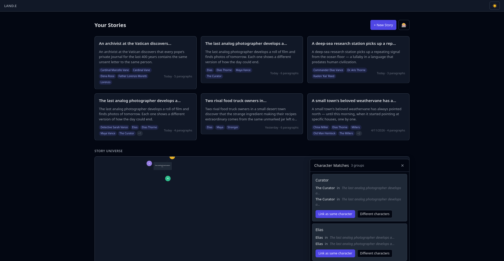
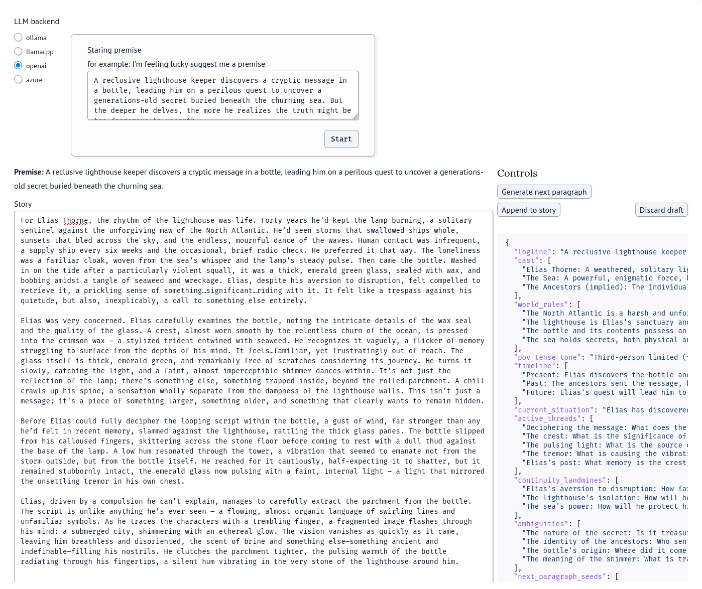
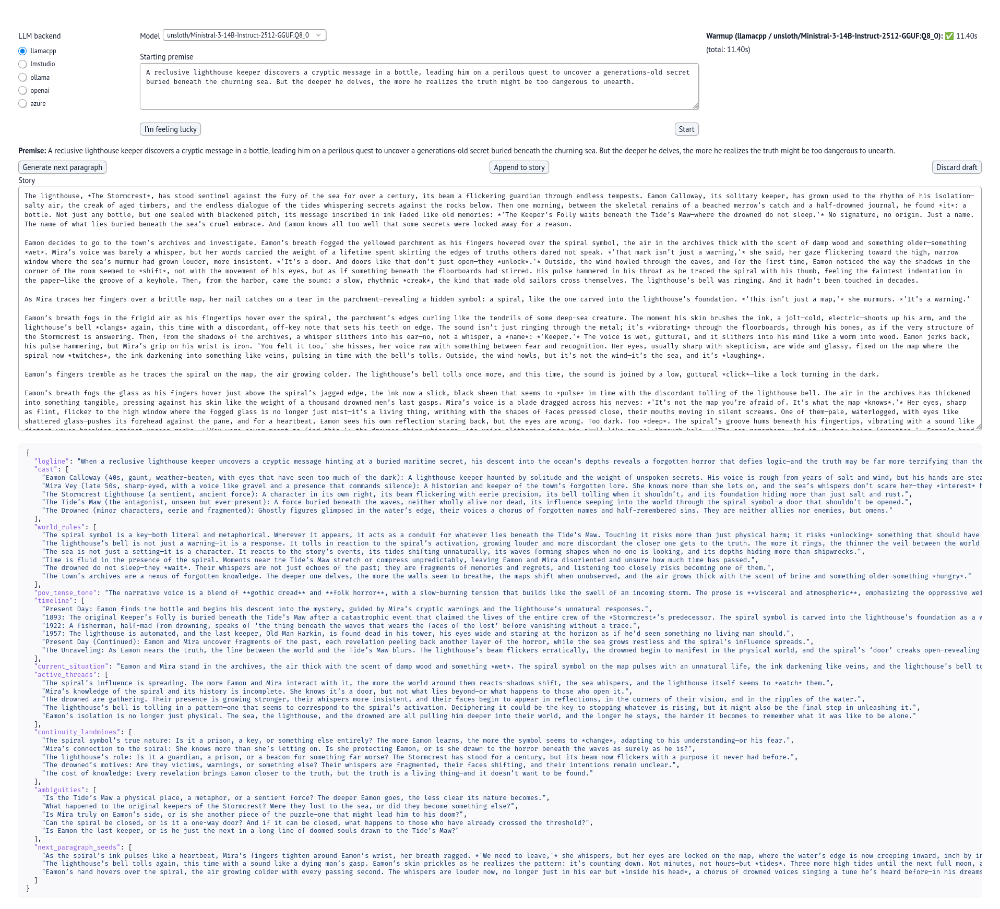
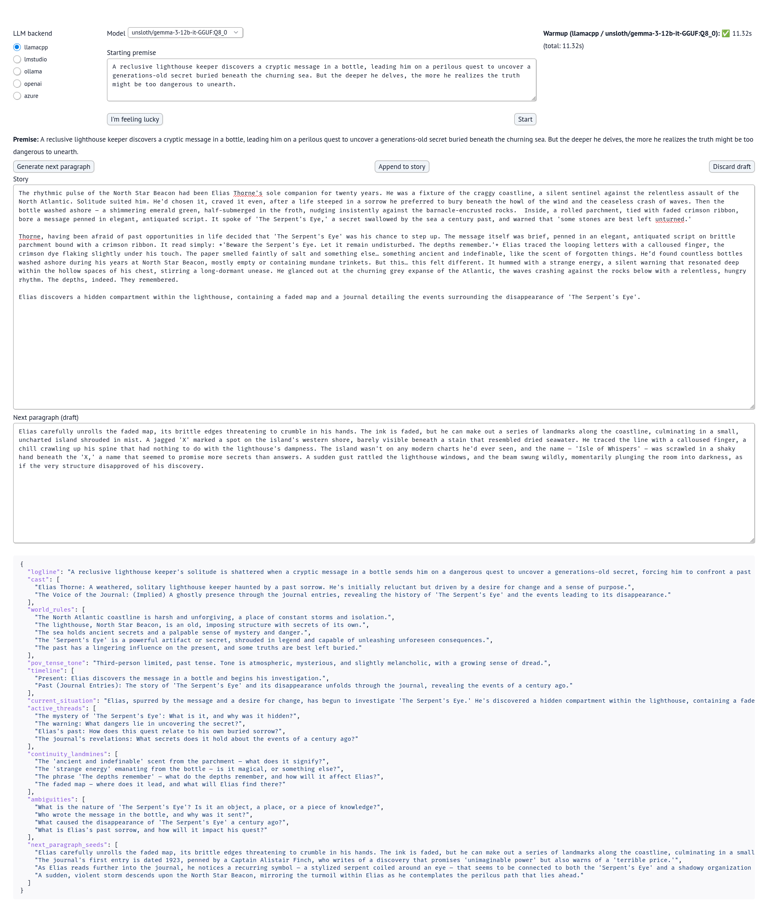

# LAND.E — Local AI Novel Drafting Environment

A local-first AI story writing application that lets you generate, edit, and track narratives using local LLMs. My attempt at making a NovelAI clone for local LLMs.



## Demo

<video src="00-supporting-files/images/README/novelai-killer-demo.mp4" controls="controls" style="max-width:100%;"></video>

## Background

I had ChatGPT code up the front end and wrap up the code into structured outputs after seeing the [original thread](https://forum.level1techs.com/t/bedhedds-ai-invasion/235812) for the idea and [DougDoug's AI Invasion series](https://youtube.com/playlist?list=PLzY2D6XUB8KfzQbQBRV2KVxrRJ3kO1Bwo&si=uh6k-siNpcEZMxbi).

## Features

- **Rich Text Editor** — Tiptap-based editor with full formatting support
- **AI Story Generation** — WebSocket streaming, text appears token-by-token in the editor
- **4-Color Provenance Tracking** — AI-generated (white), user-written (blue), user-edited (pink), initial prompt (cream)
- **Accept/Reject AI Drafts** — Accepted text persists, rejected text is removed
- **Structured Narrative Analysis** — Logline, cast, world rules, POV, timeline, active threads, continuity issues, and more
- **Interactive Node Graph** — d3-hierarchy tree layout with character supernodes, branch switching, and seed-guided generation
- **Story Dashboard** — Manage multiple stories with a cross-story character graph
- **Markdown Export** — Download stories as `.md` files
- **4 LLM Backends** — LM Studio, Ollama, OpenAI, llama.cpp

## Architecture

The application lives in the `webapp-ui` worktree as a monorepo:

```
02-worktrees/webapp-ui/
├── backend/           # FastAPI + SQLite
│   └── app/
│       ├── main.py          # Application entry point
│       ├── config.py        # Settings (DB path, CORS, default backend)
│       ├── models/          # Database (aiosqlite) + Pydantic schemas
│       ├── routers/         # REST (stories, llm) + WebSocket (ws)
│       ├── services/        # LLM client factory, story pipeline, export
│       └── db/migrations/   # SQLite schema
└── frontend/          # SvelteKit SPA
    └── src/
        ├── routes/          # App shell + main page
        └── lib/
            ├── components/  # Editor, Toolbar, Sidebars, Settings, Analysis
            ├── stores/      # Svelte 5 runes state
            ├── extensions/  # Tiptap custom provenance mark
            ├── api/         # REST client + WebSocket client
            └── types/       # TypeScript interfaces matching backend schemas
```

## Prerequisites

- Python 3.13+
- [uv](https://docs.astral.sh/uv/) (Python package manager)
- Node.js 18+ and [bun](https://bun.sh/)
- At least one LLM backend running (see [LLM Backends](#llm-backends))

## Getting Started

### 1. Clone and add worktrees

This repo uses git worktrees. After cloning, add the webapp-ui worktree:

```bash
git worktree add 02-worktrees/webapp-ui webapp-ui
```

Instructions for adding additional worktrees can be found in the [worktrees README](./02-worktrees/README.md).

### 2. Install backend dependencies

```bash
cd 02-worktrees/webapp-ui
uv sync
```

### 3. Install frontend dependencies

```bash
cd frontend
bun install
```

### 4. Start the backend

```bash
cd backend
uv run uvicorn app.main:app --reload --port 8000
```

The API is available at `http://localhost:8000`. API docs at `http://localhost:8000/docs`.

SQLite database is auto-created at `backend/data/stories.db` on first startup.

### 5. Start the frontend

In a separate terminal:

```bash
cd frontend
bun run dev
```

The app is available at `http://localhost:5173`. Vite proxies `/api` and `/ws` to the backend.

## LLM Backends

All backends use the OpenAI-compatible API pattern. Select your backend in the Settings panel (left sidebar).

| Backend | Default URL | Setup |
|---------|-------------|-------|
| **LM Studio** | `http://localhost:1234` | Install [LM Studio](https://lmstudio.ai/), load a model, start the server |
| **Ollama** | `http://localhost:11434` | Install [Ollama](https://ollama.com/), pull a model (`ollama pull <model>`) |
| **llama.cpp** | `http://localhost:8080` | Run [llama.cpp server](https://github.com/ggml-org/llama.cpp) with a GGUF model |
| **OpenAI** | OpenAI default | Set `OPENAI_API_KEY` environment variable or enter API key in Settings |

## Tech Stack

**Backend:** FastAPI, SQLite (aiosqlite), Pydantic, OpenAI SDK, WebSockets

**Frontend:** SvelteKit 2, Svelte 5 (runes), Tailwind CSS 4, Tiptap 3 (ProseMirror), d3-hierarchy, svelte-splitpanes

## Screenshots

| Early Prototype | Dashboard |
|:---:|:---:|
|  |  |

| Editor with Provenance | Node Graph |
|:---:|:---:|
|  |  |

## Project Structure

```
LAND.E/
├── 00-dev-log/              # Development journal entries
├── 00-supporting-files/     # Images, data, and supporting assets
├── 01-dev-onboarding/       # Onboarding materials
├── 02-worktrees/            # Git worktree checkouts
│   ├── webapp-ui/           # Primary application (FastAPI + SvelteKit)
│   ├── 00-experiments/      # Base Python environment / sandbox
│   └── ...                  # Other experiment worktrees
├── .planning/               # Project management docs (roadmap, milestones, requirements)
└── .venv/                   # Python virtual environment
```

## License

See [LICENSE](./LICENSE) for details.
