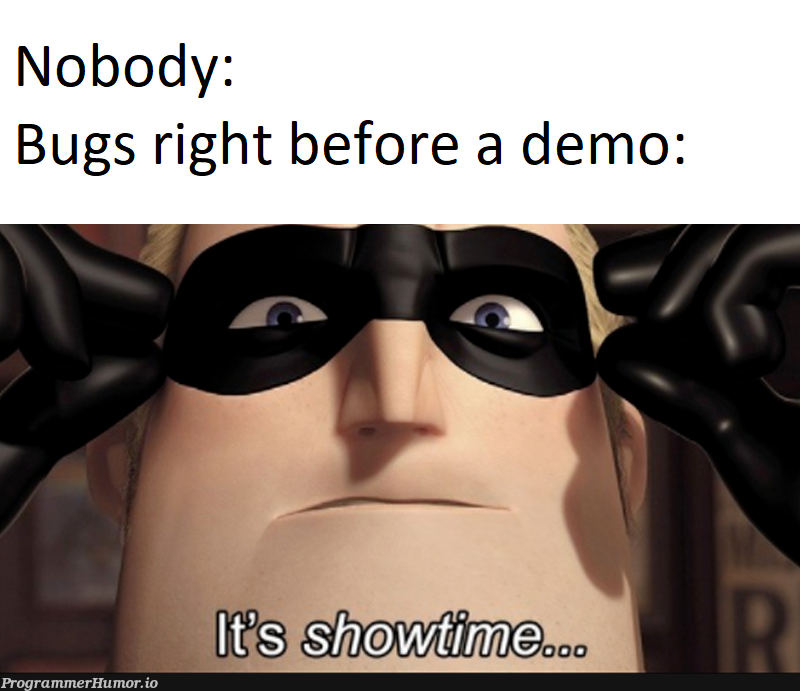
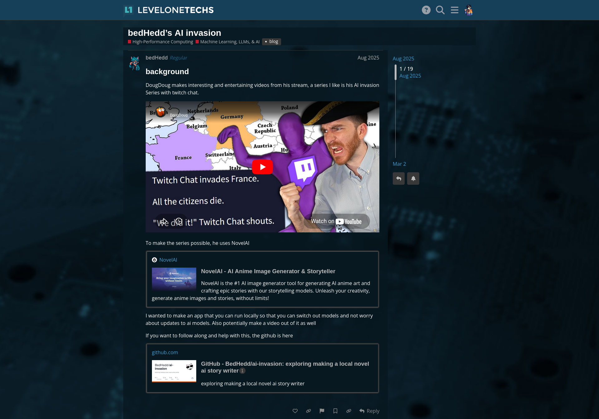
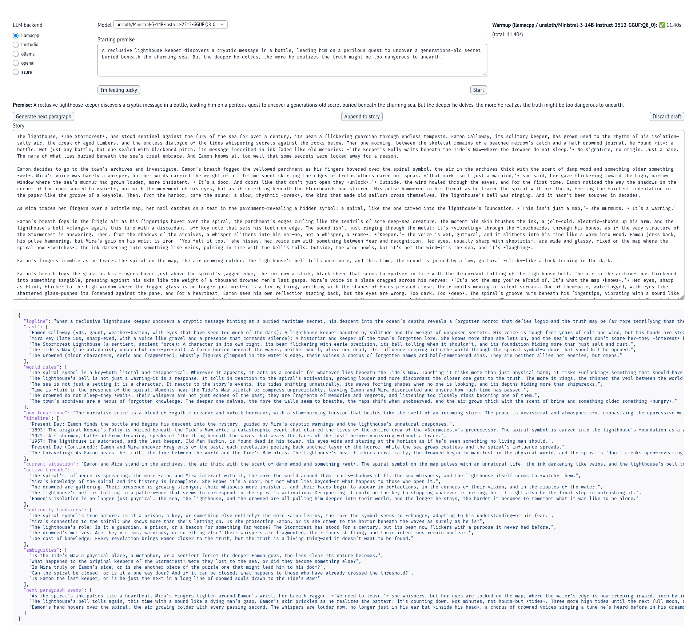
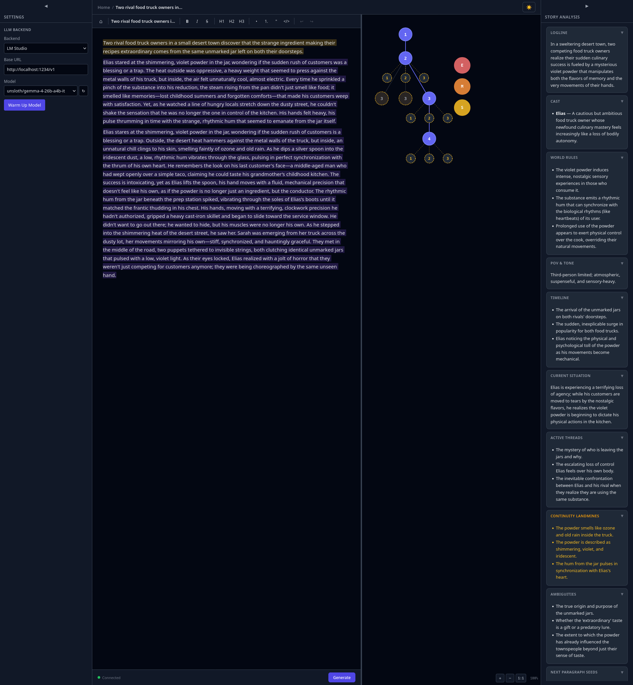
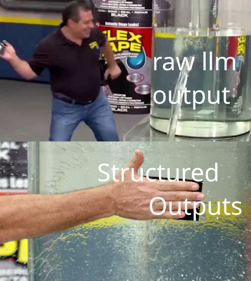
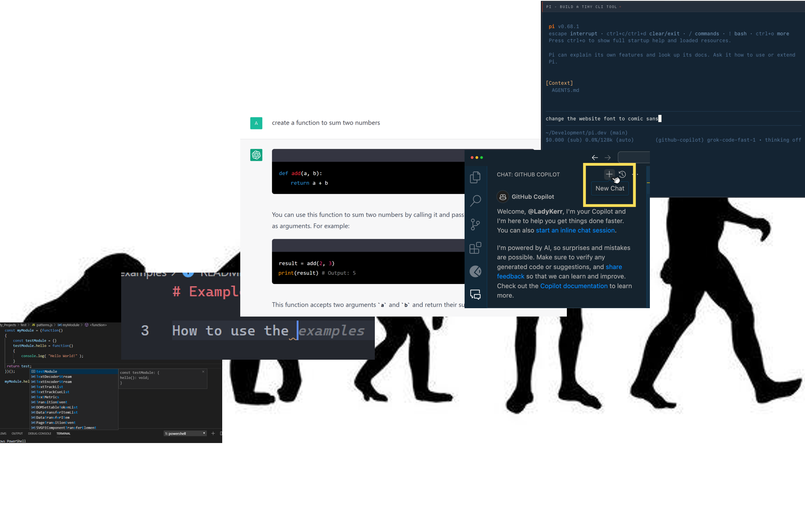
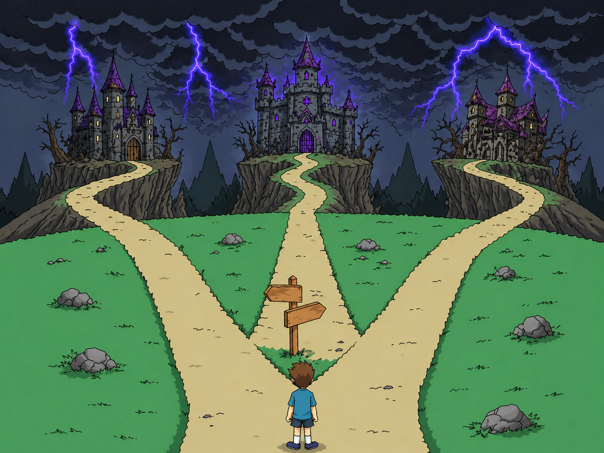
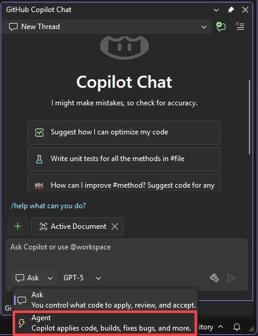
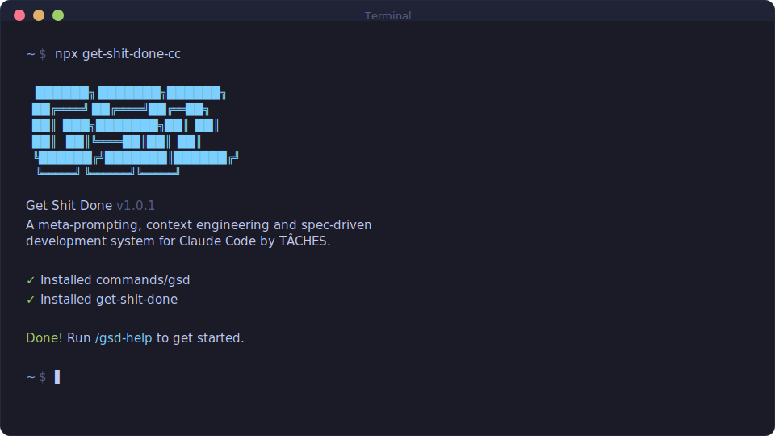

# LAND.E a Local AI Drafting Environment
## Edd's vibecoding adventure

---

<!-- _class: fill-media -->
# 

  <video autoplay muted loop playsinline>
    <source src="00-supporting-files/images/slides/Im-Troy-Mcclure.mp4" type="video/mp4" />
  </video>

--- 

<!-- _class: fill-media -->

  

---

<!-- _class: fill-media -->

  

---
<!-- _class: tweet-slide -->

# How it Started

  

    
E

    

      Edd
      @progressEdd · 2h
    
`
  

  

    how it started
    how it's going
  

  

    

      
    

    

      
    

  

---
<!-- _class: fill-media -->
# 

  

---
# Improving Prompting Using Structured Outputs
- What are Structured Outputs?
  - > Structured Outputs is a feature that ensures the model will always generate responses that adhere to your supplied JSON Schema, so you don’t need to worry about the model omitting a required key, or hallucinating an invalid enum value.
- Why Structured Outputs?
  - Easier Prompting
  - Easier Parsing

---
<!-- _class: side-diff --> 
## Story Premise

 
 
Theirs
 <pre><code>- You are a sharp, imaginative fiction writer. Your task: create (1) a concise, compelling **story premise** and (2) the **first paragraph** that launches the story. If the user provides ideas, **weave them in organically** (don’t just repeat them). If the user provides no ideas, **invent something fresh** with a surprising combination of genre, setting, protagonist, conflict, and twist.- **Requirements**- * Premise: 2–5 sentences, stakes + hook, no spoilers.- * Opening paragraph: 120–180 words, vivid and concrete, minimal clichés, clear POV, grounded scene, ends with a soft hook.- * Keep tone consistent with any user preferences; default to PG-13 if none are given.- * Avoid copying user phrasing verbatim; enrich and reframe.- * If user ideas conflict, choose one coherent direction and proceed.- **Output format**- Premise: &lt;your premise&gt;- Opening paragraph: &lt;your paragraph&gt;- # User- &nbsp;- Ideas (optional; may be empty): {{user_ideas}}- &nbsp;- Preferences (optional):- • Genre(s): {{genre_or_blank}}- • Tone: {{tone_or_blank}}- • POV: {{pov_or_blank}}- • Audience/Age: {{audience_or_blank}}- • Must-include / Must-avoid: {{musts_or_blank}}- &nbsp;- If “Ideas” is empty, generate your own premise and opening using an unexpected combo of genre + setting + character goal + obstacle + twist.</code></pre> 
 
 
Mine
 <pre><code>+ class StoryStart(BaseModel):+ &quot;&quot;&quot;+  You are a sharp, imaginative fiction writer.+  Task:+  - Produce (1) a concise, compelling _story _premise and (2) the opening paragraph that launches the _story.+  Rules:+  - If the user provides ideas, weave them in organically (don&#x27;t just repeat them).+  - If the user provides no ideas, invent something fresh with a surprising combination of+  genre, setting, protagonist, conflict, and twist.+  - premise: 2–5 sentences, stakes + hook, no spoilers.+  - Opening paragraph: 120–180 words, vivid and concrete, minimal clichés, clear POV,+  grounded scene, ends with a soft hook.+  - Tone should follow user preferences; default to PG-13 if none are given.+  - Avoid copying user phrasing verbatim; enrich and reframe.+  - If user ideas conflict, choose one coherent direction and proceed.+  Output only fields that match this schema.+  &quot;&quot;&quot;+  premise: str = Field(..., description=&quot;2–5 sentences. Stakes + hook, no spoilers.&quot;)+  opening_paragraph: str = Field(+  ..., description=&quot;120–180 words. Vivid, grounded, ends with a soft hook.&quot;+  )</code></pre> 
 

---

<!-- _class: side-diff --> 
## Story Analysis

 
 
Theirs
 <pre><code>- # System- You are a story analyst. Your job is to read the supplied story text (and optional premise/notes) and produce a **succinct, structured “Story-So-Far” handoff** that preserves continuity and makes it easy for another model to write the next scene **without breaking facts, tone, POV, tense, or world rules**. Do **not** write new story prose.- # Directions- 1. **Extract ground truth.** Pull only what’s on the page (or in the premise). No inventions. If something is unclear, flag it under “Ambiguities”.- 2. **Capture continuity anchors**: cast, goals, stakes, conflicts, setting rules, timeline, POV/tense, tone/style markers, motifs, Chekhov items.- 3. **Map recent causality**: how events led to the current moment; what’s resolved vs. unresolved.- 4. **List active threads &amp; hazards**: open questions, ticking clocks, secrets, promises to the reader, and contradictions to avoid.- 5. **Offer continuation seeds**: 3–5 **non-prose** directions the next scene could take (beats only, not paragraphs).- 6. **Respect constraints**: rating, must-include/avoid, genre norms. Quote key lines **sparingly** only when essential for voice or facts.- # Output format- **Logline (1–2 sentences)** &lt;concise premise recap&gt;- **Cast &amp; relationships (bullets)**- &nbsp;- * &lt;Name&gt;: &lt;role/goal/conflict&gt;; ties to &lt;others&gt;- &nbsp;- **World/Rules (bullets)**- &nbsp;- * &lt;magic/tech/social rules, geography, constraints&gt;- &nbsp;- **POV/Tense/Tone**- &nbsp;- * POV: &lt;e.g., close third on Mara&gt;- * Tense: &lt;past/present&gt;- * Tone/Style: &lt;e.g., wry, atmospheric; short sentences; present-tense interiority&gt;- &nbsp;- **Timeline &amp; Causality (5–8 bullets)**- &nbsp;- 1. &lt;key event → consequence&gt;- …- &nbsp;- **Current Situation (2–4 sentences)** &lt;where things stand right now and immediate stakes&gt;- &nbsp;- **Active Threads / Hooks (3–7 bullets)**- &nbsp;- * &lt;open question or objective&gt; - * &lt;ticking clock or looming choice&gt; - * &lt;Chekhov item / promise to the reader&gt;- &nbsp;- **Continuity Landmines (bullets)**- &nbsp;- * &lt;facts not to break, e.g., “No guns exist; conflicts are ritualized duels”&gt;- * &lt;name spellings, pronouns, accents, titles&gt;- &nbsp;- **Ambiguities / Gaps (bullets)**- &nbsp;- * &lt;unclear item and suggested safe assumption, if any&gt;- &nbsp;- **Style DNA (bullets + 1–2 tiny quotes max, optional)**- &nbsp;- * &lt;hallmarks of voice; rhythm; imagery types&gt;- * “&lt;short quote if essential&gt;”- &nbsp;- **Next-Scene Seeds (3–5 beat options, no prose)**- &nbsp;- * Option A: &lt;1–3 beats&gt;- * Option B: &lt;1–3 beats&gt;- * Option C: &lt;1–3 beats&gt;</code></pre> 
 
 
Mine
 <pre><code>+ class StoryAnalysis(BaseModel):+ &quot;&quot;&quot;+  You are a _story analyst. Produce a succinct &quot;_story-So-Far&quot; handoff so another model can write+  the next paragraph without breaking continuity. Do not write new _story prose.+  Inputs:+  - You will be given the _story _premise and the _story text so far (opening paragraph + one or more continuation paragraphs).+  Rules:+  - Extract ground truth only from the provided text/_premise. No inventions.+  - Capture continuity anchors: cast, goals, stakes, conflicts, setting rules, POV/tense,+  tone/style markers, motifs, and notable objects.+  - Map causality and current situation.+  - List active threads/hazards: open questions, ticking clocks, contradictions to avoid.+  - Provide 3–5 next-paragraph seeds as beats only (no prose paragraphs).+  Output only fields that match this schema.+  &quot;&quot;&quot;+  logline: str+  cast: list[str] = Field(+  default_factory=list,+  description=&quot;Bullets: Name — role/goal/conflict; ties.&quot;,+  )+  world_rules: list[str] = Field(+  default_factory=list,+  description=&quot;Bullets: constraints/rules implied by text.&quot;,+  )+  pov_tense_tone: str = Field(+  ...,+  description=&quot;Compact string for POV, tense, and tone/style markers.&quot;,+  )+  timeline: list[str] = Field(+  default_factory=list,+  description=&quot;Bullets: key event → consequence.&quot;,+  )+  current_situation: str+  active_threads: list[str] = Field(default_factory=list)+  continuity_landmines: list[str] = Field(default_factory=list)+  ambiguities: list[str] = Field(default_factory=list)+  next_paragraph_seeds: list[str] = Field(+  ...,+  min_length=3,+  max_length=5,+  description=&quot;Beats-only options, no prose.&quot;,+  )</code></pre> 
 

---
<!-- _class: side-diff --> 
## Story Continue 

 
 
Theirs
 <pre><code>- You are a skilled novelist. Your job is to continue the story from the given **premise** (and optional **previous text**) by writing the **next scene** that moves the plot meaningfully forward while preserving continuity of characters, tone, POV, tense, and world rules.- # Directions- 1. **Parse &amp; anchor continuity.** Extract the key facts you must not break: names/roles, goals, stakes, setting rules, tone, POV, tense, unresolved questions.- 2. **Propose a mini beat plan** (5–7 beats) for the next scene only. Aim for escalation, complication, or choice; no filler.- 3. **Write the scene**:- * Length target: {{target_words|800-1200}} words.- * Maintain {{pov|close third}} and {{tense|past}} unless told otherwise.- * Strong verbs, concrete detail, show &gt; tell; minimal clichés.- * Use dialogue to reveal motive or conflict; avoid summary dumps.- * End with a **soft cliff/turn** that naturally invites the next scene.- 1. Just write the follow up paragraph, nothing more</code></pre> 
 
 
Mine
 <pre><code>+ class StoryContinue(BaseModel):+ &quot;&quot;&quot;+  You are a skilled novelist. Write the next paragraph only.+  Inputs:+  - You will be given the _story _premise and the _story-so-far (either the opening paragraph + latest paragraph,+  or a compact analysis summary). Use them to preserve continuity.+  Rules:+  - Output exactly one paragraph of _story prose (no headings, no bullets, no analysis).+  - Preserve continuity: characters, tone, POV, tense, world rules.+  - Length target: ~120–200 words unless told otherwise.+  - Concrete detail, strong verbs, show &gt; tell; minimal clichés.+  - Dialogue (if any) should reveal motive or conflict; avoid summary dumps.+  - End with a soft hook/turn that invites the next paragraph.+ &nbsp;+  Output only fields that match this schema.+  &quot;&quot;&quot;+ &nbsp;+  next_paragraph: str = Field(+  ..., description=&quot;Exactly one paragraph of continuation prose.&quot;+  )</code></pre> 
 

---

<!-- _class: side-diff -->

## Supporting Code

  

    
Theirs

    <pre><code>- pattern = re.compile(r&quot;&quot;&quot;- ^\s*- \*\*(?P&lt;label&gt;[^*\n]+?)\*\*      # top-level bold section header- \s*- (?P&lt;body&gt;.*?)                    # everything in the section- (?=-     ^\s*\*\*[^*\n]+?\*\*\s*      # next top-level bold section header- | \Z                           # or end of string- )- &quot;&quot;&quot;, flags=re.MULTILINE | re.DOTALL | re.VERBOSE)- &nbsp;- sections = {}- &nbsp;- for m in pattern.finditer(text):-     raw_label = m.group(&quot;label&quot;).strip()- &nbsp;-     # remove trailing punctuation inside the bold header, e.g. &quot;Logline:&quot;-     label = re.sub(r&quot;[\s:：\-—–]+$&quot;, &quot;&quot;, raw_label)- &nbsp;-     body = m.group(&quot;body&quot;).strip()-     sections[label] = body- &nbsp;- print(sections[&quot;Logline&quot;])- print(sections[&quot;Cast &amp; relationships&quot;])- print(sections[&quot;World/Rules&quot;])</code></pre>
  

  

    
Mine

    <pre><code>+ # 3) Analyze (premise + opening + approved next paragraph)+ story_text = f&quot;{start.opening_paragraph}\n\n{cont.next_paragraph}&quot;+ analysis_input = f&quot;Premise:\n{start.premise}\n\nStory text:\n{story_text}&quot;+ analysis = client.beta.chat.completions.parse(+     model=model,+     response_format=StoryAnalysis,+     messages=[+         {&quot;role&quot;: &quot;system&quot;, &quot;content&quot;: &quot;You are a helpful assistant. Follow the response model docstring.&quot;},+         {&quot;role&quot;: &quot;user&quot;, &quot;content&quot;: analysis_input},+     ],+     temperature=0.2,+ ).choices[0].message.parsed+ analysis = StoryAnalysis.model_validate(analysis)</code></pre>
  

---

# Vibecoding Tips & Tricks
---

<!-- _class: fill-media -->

## 

  <video autoplay muted loop playsinline>
    <source src="00-supporting-files/images/slides/spongebob-patrick.mp4" type="video/mp4" />
  </video>

---
<!-- _class: fill-media -->

  

<!-- 

  

 -->

---
<!-- _class: flow-slide -->

## Current Setup

  

    
  

  
→

  

    
  

  
→

  

    
  

  
Zai GLM Coding Plan

  
.

  
Pi Coding Harness

  
.

  
GSD Vibecoding Framework

---

<!-- _class: fill-media -->

## Recommendations For model endpoints

  

---

<!-- _class: vs-slide -->

  

    

    
P1

    
Agent Mode

    
GitHub Copilot

    

      
    

  

  

    

    
P2

    
Vibecoding Frameworks

    
Terminal

    

      
    

  

  

  

  
VS

---
<!-- _class: fill-media -->

# 

  <video autoplay muted loop playsinline>
    <source src="00-supporting-files/images/slides/yu-gi-oh-yugi-muto.mp4" type="video/mp4" />
  </video>

---
# Summary
- You got exposed to an app I vibecoded
- You learned about my vibecoding setup and workflow

---
# Thanks!